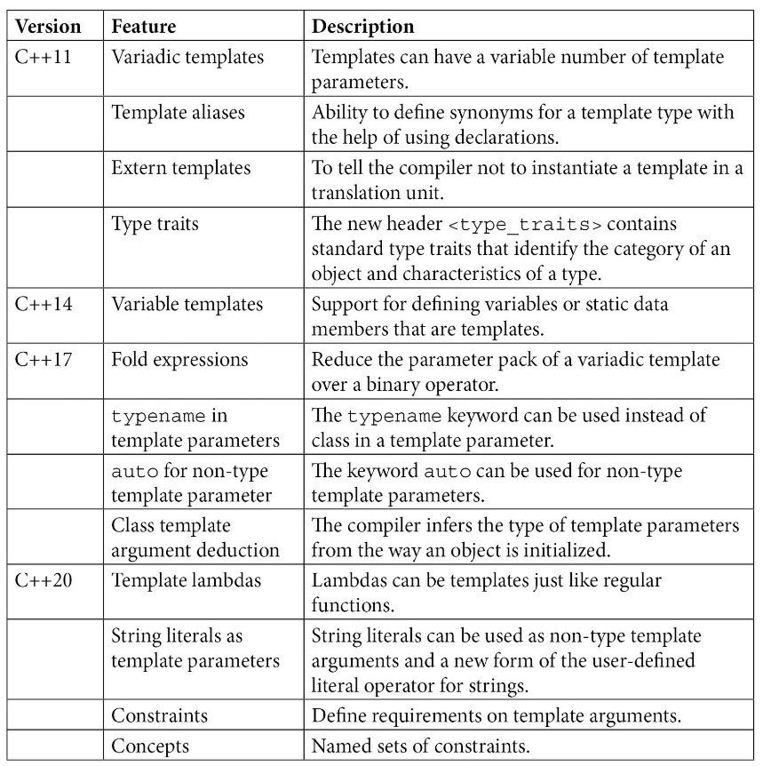

# cpp-templates

## Links
[Code for C++ Templates - The Complete Guide, 2nd Edition ](https://github.com/mpoullet/tmplbook)  
[Code for Templates meta programming with C++](https://github.com/PacktPublishing/Template-Metaprogramming-with-CPP)  

## Notes

### Template features by C++ standard
